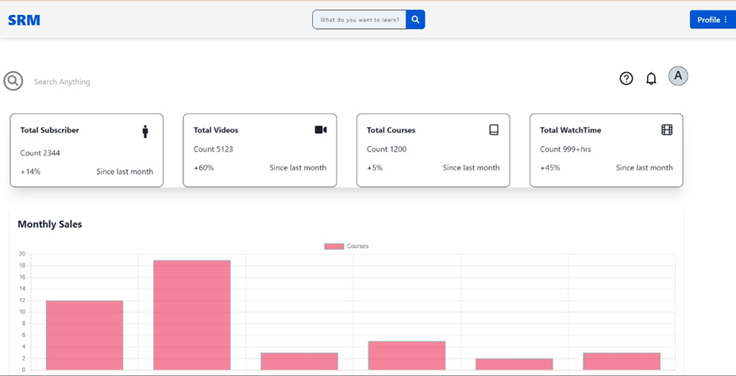
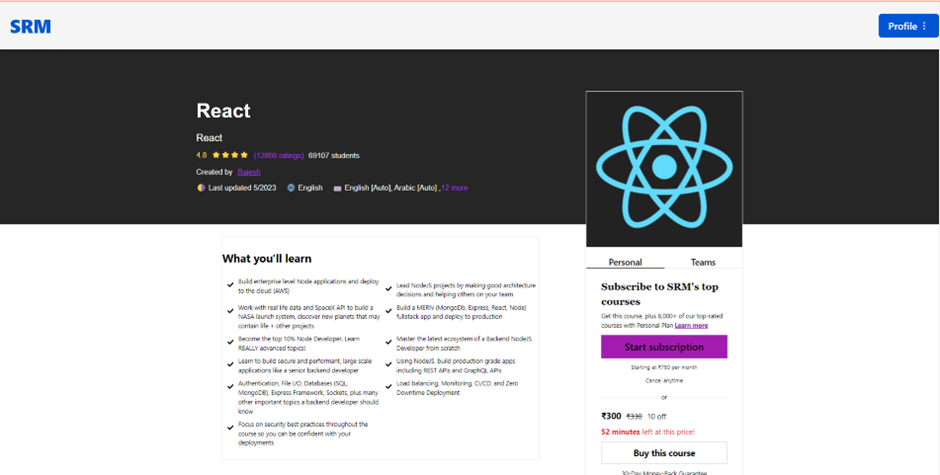

<div align="center">


# 🛡️ Project Defend: Smart Cybersecurity AI & E-Learning Platform

[](https://opensource.org/licenses/MIT)
[](https://reactjs.org/)
[](https://nodejs.org/)
[](https://www.mongodb.com/)
[](https://chakra-ui.com/)

**Empowering your learning journey with a modern, responsive, and feature-rich platform.**

[Explore Features](#-key-features) • [Installation](#-getting-started) • [Screenshots](#-visual-walkthrough) • [Tech Stack](#-technology-stack)

</div>

---

## ⚡ Quick Start (Windows)

The easiest way to get the project running is using the one-click starter:

1. Double-click **`start-local.bat`** in the project root.
2. It will automatically install missing dependencies and launch both servers.

---

**Project Defend** is a next-generation E-learning platform integrated with a real-time AI Cybersecurity Defense Agent. Built using the MERN stack and Python, it goes beyond learning by actively defending the server against real-world attack vectors like XSS, NoSQL Injection, and DoS floods using Machine Learning and LLM reasoning.

### 🌟 Key Features

-   🛡️ **AI Defense Integration**: Real-time threat detection and mitigation using GraphSAGE and LangGraph.
-   📊 **Advanced Security Dashboards**: Live telemetry monitoring and attack visualization.
-   🔐 **Secure Authentication**: JWT-based login, signup, and profile management.
-   📚 **Course Management**: Instructors can create, edit, and delete courses.
-   📱 **Responsive Design**: Optimized for desktop, tablet, and mobile devices.

---

## 🛠 Technology Stack

### Frontend
- **React.js**: Library for building interactive user interfaces.
- **Redux & Thunk**: Robust state management and async logic.
- **Chakra UI**: Premium, accessible component library.
- **Tailwind CSS**: Modern utility-first CSS framework.
- **Chart.js**: Dynamic data visualization for dashboards.

### Backend
- **Node.js & Express.js**: Fast and scalable server-side environment and API framework.
- **MongoDB & Mongoose**: Flexible NoSQL database with powerful object modeling.
- **JWT**: Secure authentication and authorization.
- **Multer**: Handling file uploads (course materials).

---

## 🚀 Getting Started

### Prerequisites

- [Node.js](https://nodejs.org/) (v14+)
- [MongoDB](https://www.mongodb.com/) (Local or Atlas)
- npm or yarn

### Installation Steps (Manual)

If you prefer to run components separately:

1. **Clone the Project**
   ```bash
   git clone https://github.com/Sai-Chakradhar-Mahendrakar/Elearning-Platform-Using-MERN.git
   cd Elearning-Platform-Using-MERN
   ```

2. **Root Dependencies**
   ```bash
   npm install
   ```

3. **Backend Setup**
   ```bash
   cd backend
   npm install
   ```
   - Create a `.env` file in the `backend` directory:
     ```env
     PORT=8080
     MONGODB_URI=your_mongodb_connection_string
     JWT_SECRET=your_jwt_secret
     ```
   - Start the server:
     ```bash
     npm run server
     ```

3. **Frontend Setup**
   ```bash
   cd ../frontend
   npm install
   ```
   - Start the React application:
     ```bash
     npm start
     ```

The platform will be live at `http://localhost:3000`.

---

## 📸 Visual Walkthrough

### 🏠 Home Page


### 📊 Admin Dashboard


### 🎓 Learning Experience


---

## 📂 Project Structure

```text
Elearning-Platform-Using-MERN/
├── backend/            # Express.js Server & MongoDB Models
│   ├── models/         # Database Schemas
│   ├── routes/         # API Endpoints
│   ├── middlewares/    # Auth & Error Handling
│   └── index.js        # Entry point
├── frontend/           # React Application
│   ├── src/
│   │   ├── components/ # Reusable UI components
│   │   ├── Pages/      # Main navigation pages (Login, Dashboard, etc.)
│   │   ├── redux/      # State management logic
│   │   └── App.js      # Main component
├── screenshots/        # Project visual assets
└── README.md           # You are here!
```

---

## 🤝 Contributing

Contributions make the open-source community an amazing place!
1. Fork the Project
2. Create your Feature Branch (`git checkout -b feature/AmazingFeature`)
3. Commit your Changes (`git commit -m 'Add some AmazingFeature'`)
4. Push to the Branch (`git push origin feature/AmazingFeature`)
5. Open a Pull Request

---

## ⚖️ License

Distributed under the MIT License. See `LICENSE` for more information.

---

<p align="center">Made with ❤️ for Learners everywhere.</p>
