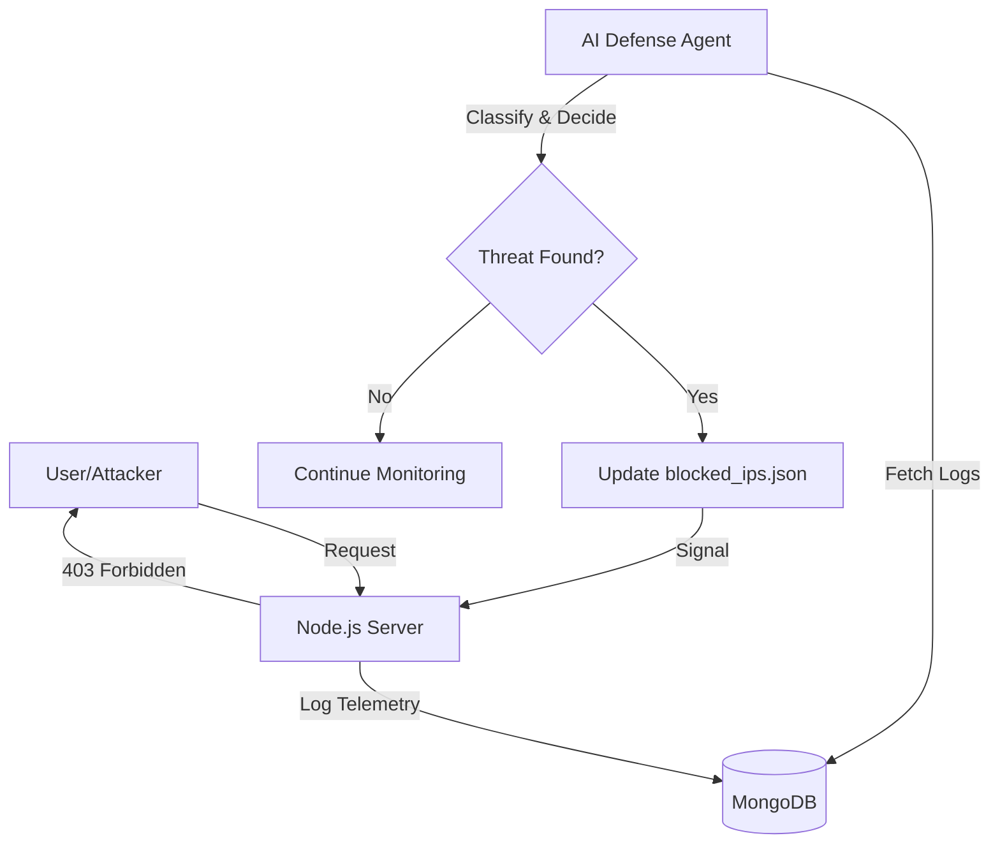

# Project Defend: AI-Powered Cyber Defense System


## 🛡️ Overview

**Project Defend** is a next-generation Cybersecurity Defense Platform that combines a full-featured MERN E-learning application with a sophisticated **AI Defense Agent**. 

The system doesn't just monitor traffic—it actively fights back. By utilizing **Graph Neural Networks (GNN)** and **Isolation Forests**, the AI agent identifies malicious behavior (DoS, XSS, SQLi) in real-time and updates the server's firewall dynamically to block threats within seconds.

---

## 🚀 Key Features

### 1. Intelligent AI Defense Agent
- **Autonomous Mitigation**: Automatically writes to `blocked_ips.json` to trigger an instant Node.js firewall response.
- **Explainable AI**: The agent provides reasoning for every block (e.g., "Signature Match: XSS Payload detected").
- **LangGraph Integration**: Uses stateful agentic workflows to escalate from simple warnings to permanent IP blocks.

### 2. Multi-Model Anomaly Detection
- **Isolation Forest & OC-SVM**: Detects volumetric threats like DoS and Brute Force by identifying statistical outliers in traffic patterns.
- **Graph Neural Networks (GNN)**: Maps user relationships to identify sophisticated account impersonation and unauthorized access.

### 3. Real-Time Security Dashboard
- **Live Terminal Feed**: A professional terminal UI showing every request, every detection, and every neutralisation.
- **Universal Log Management**: A unified MongoDB-backed logging system that tracks telemetry across all services.

---

## 🛠️ Tech Stack

| Component | Technologies |
| :--- | :--- |
| **Frontend** | React, Redux, Tailwind CSS, Chakra UI |
| **Backend** | Node.js, Express, MongoDB (Mongoose) |
| **AI Agent** | Python, LangGraph, Scikit-Learn, PyTorch (GNN) |
| **LLM Core** | Mistral AI, Groq (Llama 3.3-70B) |
| **Security** | JWT, Bcrypt, IP-based Firewalling |

---

## 📊 Architecture



---

## 🚦 Getting Started

### Prerequisites
- **Node.js**: v16+ 
- **Python**: 3.9+ 
- **MongoDB**: Local or Atlas instance
- **API Keys**: Mistral AI or Groq (add to `.env`)

### Installation
1. **Clone the Repo**:
   ```bash
   git clone https://github.com/codemonkx/Server-Defence-System.git
   cd Server-Defence-System
   ```
2. **Backend Setup**:
   ```bash
   cd Elearning-Platform-Using-MERN/backend
   npm install
   cp .env.example .env
   ```
3. **AI Agent Setup**:
   ```bash
   cd ../../final-year-pro
   pip install -r requirements.txt
   cp .env.example .env
   ```

---

## 🧪 Simulation & Demo

We have provided a series of batch files to demonstrate the system's capabilities in seconds:

1. **`1_start_website.bat`**: Launches the MERN stack (Backend + Frontend).
2. **`3_run_defense_agent.bat`**: Starts the AI live monitor.
3. **`2_run_attack.bat`**: Simulates a high-intensity DoS attack.
4. **`4_run_nosql_attack.bat`**: Simulates a signature-based NoSQL Injection.
5. **`6_run_impersonation_demo.bat`**: Demonstrates GNN-based anomaly detection.

---

## 📈 ML Performance
The system uses a weighted voting ensemble.

## 📄 License
This project is for educational and research purposes. 

**Developed by codemonkx**
